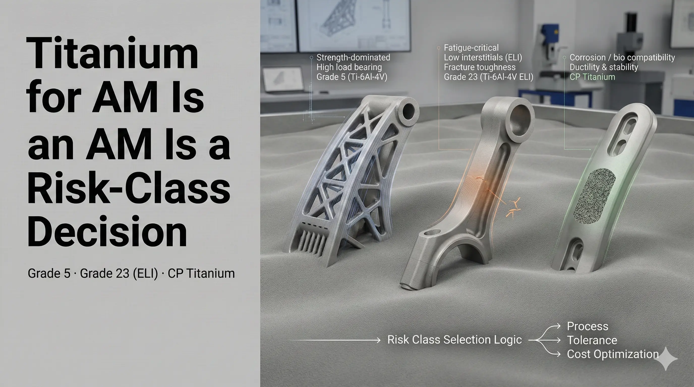

Titanium is not one material choice. In additive manufacturing, the alloy grade controls strength, ductility, oxygen sensitivity, fatigue assumptions, post-processing, and the evidence package needed for acceptance. A good RFQ names the material, but it also explains why that material is required.

## Ti-6Al-4V Grade 5

Ti-6Al-4V Grade 5 is the default starting point for many titanium AM structural parts because it offers high strength-to-weight performance and broad process familiarity. It is common in aerospace, motorsport, robotics, industrial housings, and lightweight brackets.

Choose Grade 5 when the requirement is structural performance and the acceptance path can tolerate the material's normal interstitial range. The quote should still define the standard, process route, post-processing, and inspection scope. A generic "Ti64" note is not enough for production-intent work.

## Ti-6Al-4V ELI Grade 23

Grade 23 ELI has tighter interstitial limits, especially oxygen and often nitrogen/hydrogen. This can support fracture toughness and fatigue-sensitive requirements in certain applications. It is often discussed for medical-adjacent parts and high-reliability structures.

Use ELI when the evidence requirement justifies it. If the only reason is "higher quality," the RFQ is underspecified. State the mechanical requirement, standard, surface condition, post-processing, and documentation expectation.

## CP Titanium Grades 1-4

Commercially pure titanium is reviewed when ductility, corrosion behavior, or a non-structural titanium requirement matters more than maximum strength. CP Ti can be relevant for chemical, corrosion, or special forming behavior, but process availability and parameter control must be checked.

The RFQ should state which grade is required and why. CP Ti Grade 1 and Grade 4 do not represent the same design space.

## Powder and Chemistry Controls

For titanium powder, interstitial elements matter. Oxygen, nitrogen, and hydrogen influence strength, ductility, and fatigue. Powder particle size distribution, morphology, apparent density, tap density, reuse state, and storage controls can affect recoating and build stability.

High-risk applications should define chemistry limits, PSD reporting, powder lot traceability, and reuse policy. If reuse state matters, it must be documented as part of traceability.

## Selection Checklist

- Alloy grade and standard.
- Process route: LPBF, EBM, DED, or conventional alternative.
- Service environment: temperature, corrosion, fatigue, biocompatibility, or leak concern.
- Post-processing: stress relief, anneal, HIP, machining, surface finish, cleaning.
- Evidence: COA, COC, build record, CMM, CT, coupons, density, traceability.

The fastest material decision starts from acceptance criteria, not from a material name alone.
