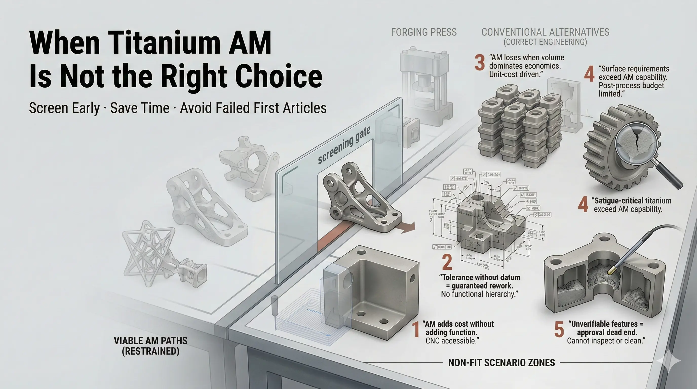

Titanium additive manufacturing is not a default manufacturing route. It is a powerful process when geometry changes performance, but it can be a poor choice for simple parts, undefined requirements, or high-risk parts without evidence budget.

## Simple Geometry

If the part is a block, plate, shaft, simple bracket, or stock-like shape with easy tool access, CNC machining is often faster, cheaper, and easier to inspect. AM becomes difficult to justify if it does not reduce assembly mass, unlock internal geometry, or improve system behavior.

## Tight All-Over Tolerances

Titanium AM can support tight functional tolerances when critical features are machined and referenced to stable datums. It is weaker when a drawing demands tight all-over tolerances on as-built surfaces with no datum strategy or machining access.

## Inaccessible Internal Cavities

Internal channels, lattices, and cavities are useful only when powder can be removed and acceptance can be demonstrated. Dead ends, fine hidden lattices, and tortuous channels can trap powder and create inspection disputes.

## Fatigue or Leak Risk Without Evidence

Fatigue and leak-critical titanium AM parts need surface, defect, post-processing, and inspection controls. If the project cannot budget HIP, surface finishing, CT, CMM, coupons, or other evidence when required, the AM route may be unsafe or commercially impractical.

## High-Volume Cost Pressure

AM can win on lead time, complexity, or system value. It often loses when the part is high volume, low complexity, and cost-sensitive. Casting, forging, stamping, machining, or hybrid routes may provide better economics.

## Drop-In Forging Replacement

An AM part is not automatically equivalent to a forged part. Forgings have different grain flow and defect behavior. Replacing forging one-to-one usually requires redesign, post-processing, and a new qualification basis.

## Go / No-Go Checklist

Do not use titanium AM when:

- Weight reduction does not improve system behavior.
- Geometry is simple and easy to machine.
- Critical tolerances cannot be finished or inspected.
- Internal powder cannot be removed.
- Fatigue/leak/regulatory evidence is required but not budgeted.
- Procurement compares only print-only price.

When these conditions appear, machining, casting, forging, or a hybrid process is likely a better first route.
